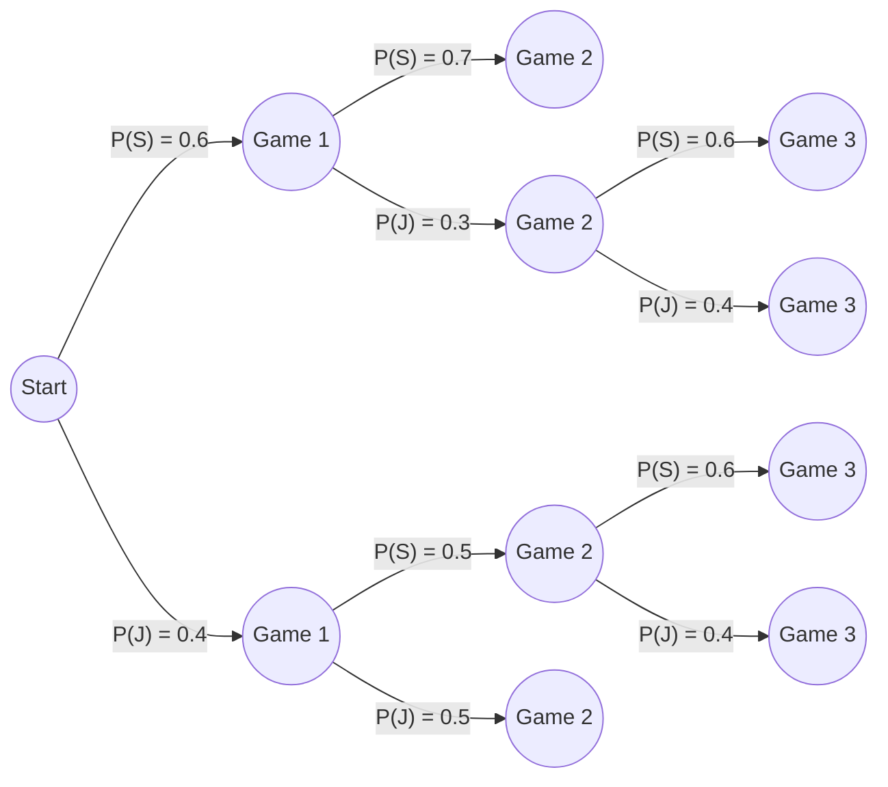

# Probability Tree

A tree that lists all the possible paths in stages. The probability of one path occurring is taking all the probabilities along that path and multiply them together. To check if the tree is correct take the probability of each path and add them up it should equal to 1 (100%).

**Example:**
John and Sarah are playing a chess tournament. They will play the best two out of three games.  
- Sarah has a slight edge, so she has a 60% chance of winning the first game.  
- If Sarah wins the first game, she gains confidence, so her chance of winning the second game is 70%  
- If Sarah loses the first game, she loses confidence, so her chance of winning the second game is 50%  
- The third game (if there is one) is back to 60% chance for Sarah.

Lets denote $P(S)$ as the probability of Sally winning each game and the $P(J)$ which is the probability of John winning each game (which is also $P(S^c)$ where Sally does not win that game).

Probability for each Path (Top to bottom): 
- Path 1: $(0.6)(0.7) = 0.42$
- Path 2: $(0.6)(0.3)(0.6) = 0.108$
- Path 3: $(0.6)(0.3)(0.4) = 0.072$
- Path 4: $(0.4)(0.5)(0.6) = 0.12$
- Path 5: $(0.4)(0.5)(0.4) = 0.08$
- Path 6: $(0.4)(0.5) = 0.20$

> Adding them up should give 1.

> [!example] Questions:  
>  1. What is the probability that Sarah wins the tournament?  
>  2. What is the probability that the tournament ends in two games?  
>  3. What is the probability that John wins, but it takes three games?
>> [!success]- Solution
>> 1. 0.648
>> 	1. There are three paths where Sarah wins: Path 1, 2, and 4.
>> 2. 0.62
>> 	1. There two paths where the tournament ended in 2 games: Path 1 and 6.
>> 3. 0.152
>> 	1. There are two paths that John wins that took three games: Path 3 and 5.

# Permutation

Different ways of ordering objects are called **permutations.**
- Example: 
	- Suppose we have the list of countries: Japan, Germany, and Italy. The size of this list is 3. How many different ways we can order them? (Permutations)
		- We have 3 choices for the first country, 2 choices for the second country since we already one for the first country, therefore there are 6 permutations or different ways of ordering the three countries. 
		- $6 = 3!$

>Formula for amount of permutations is $n!$ where $n$ is the number of objects.

## $n$ and $r$ meaning
>[!info]
> Typically, we have $n$ as the number of items to choose from and $r$ as the number of items we are choosing, or the number of times we are choosing some item. 
# Lists or Tuples
- Denoted with $()$
- Repeats allowed and order matters
	- Example: $(1, 2), (2, 2), (3, 2),$ etc
		- Can include both $(1, 2), (2,1)$ since $(2, 1) \neq (1, 2)$

Suppose we have 10 doors lined in a row and we can paint each door a color either red, green or blue. How many ways we can do this? 
- The number of items/choices we can choose from is 3 which are red, green, and blue so let $n = 3$ 
- The number of doors we are choosing to paint a color (or the number of times we need to choose a color) is 10 so let $r = 10$
- For each door we can choose 3 different color therefore the different of ways to do this is $3^{10}$

> Formula for lists/tuples is: $n^r$ 

## R-Permutations (lists without repeats)
- Also denoted with $()$
- Does not allow repeats and order still matters
	- Example: $(1, 2, 3), (2, 3, 5), (4, 6, 10)$
		- Cannot include $(1, 2, 2)$ since 2 is repeated twice

Suppose we want to visit 5 states out of the 50 states $(n = 50, r = 5)$. How many times we can do this?
- Answer: $(50)(49)(48)(47)(46)$
	- Each time we choose a state to visit we take that state out of the total possible states we can visit since visiting the same state twice doesn't make sense.

>Formula: $P(n , r) = {} _nP_r = \dfrac {n!}{(n-r)!}$

# Combinations or Sets
- Denoted with $\{\}$
- Repeats not allowed and order doesn't matter
	- Example: $\{1, 2\}, \{2, 3\}, \{4, 5\}$
		- Cannot include $\{2, 1\}$, that is the same as $\{1, 2\}$ since order doesn't matter

There is 435 House of Representative and we have to choose 3 representative to make a committee $(n = 435, r = 3)$. How many ways this can be done?
- Answer: $\dfrac {(435)(434)(433)(432)!}{(435 - 3)! *3!} = \dfrac {(435)(434)(433)}{3!}$
	- This is using R-Permutations formula then divided by $3!$ which is $r!$. This is because in R-Permutations order matters but in set order does not matter so we are counting more in our calculation (which are identical sets) if we did $(435)(434)(433)$ therefore we need to divide by the amount of identical sets to get just one set.
		- Suppose we choose 3 representatives for a committee, lets call them Rep. 1, Rep. 2, and Rep. 3.
			- Using permutations the number of ways to order them is $3!$.
			- However, it doesn't matter how we order them it still going to be Rep. 1, Rep. 2, and Rep. 3 in the same committee. Therefore, we divide by the amount of permutations there are for the 3 representatives. 

>Formula: $C(n ,r) = {n \choose r} = \dfrac {P(n, r)}{r!} = \dfrac {n!}{(n-r)! * r!}$

There is no need to use the big fraction you can just leave the answer as ${n \choose r}$ notation which read as "n choose r". So, using the example above the answer can just be $435 \choose 3$

## Multisets or Bags

- Denoted with $[]$ or $<>$
- Repeats allowed and order doesn't matter
	- Example: $[1, 2, 2], [3, 5, 9], [9, 9, 8]$
		- Cannot include $[2, 2, 1]$ as that is the same as $[1, 2, 2]$ since order doesn't matter

**Visualizing Multiset:** 
- Given the set A = $\{1, 2\}$ find all the multiset of A with a size of 2
	- Answer: There are three multiset of A with a size of 2
		- $[1, 2], [1, 1], [2, 2]$ since repeats are allowed
	- Therefore, this is really "3 choose 2" so ${3 \choose 2} = 3$ since we have 2 items to choose from but we can repeat one of the two items.

Suppose we have bag of snickers and skittles. How many different ways to grab 3 candies from the bag? $(n = 2, r = 3)$
- Answer: 4
	- There are 2 items we can choose $\{snickers, skittles\}$, we need to grab 3 candies of either snickers or skittles, so the possible ways are:
		- $[snicker, snicker, skittle]$ 
		- $[snicker, skittle, skittle]$, 
		- $[snicker, snicker, snicker]$, 
		- $[skittle, skittle, skittle]$
	- So, basically we have two items (snickers and skittles) to choose from but we can repeats any of the two items (snickers and skittles) once or twice.

> Formula: ${n + r - 1 \choose r}$, which means "the number of multisets of size $r$ that can be taken from a set size of $n$. 

### Other Intuitive approaches

1. **Buckets**

Using the snickers and skittles example above but lets use $r = 5$ instead. 
Let visualize each item as bucket separate by vertical bar(s), so we have the snicker bucket and the skittle bucket. The number of items we need to choose is 5, lets denoted those 5 items as star \*. 
- We have 5 stars \* \* \* \* \*
- We have two buckets (I will use a table) with a vertical bar separating the two. 

| Snicker bucket | \|  | Skittle bucket |
| -------------: | :-: | -------------- |
|                | \|  |                |
- Let each row as different ways to getting 5 candies of either snickers or skittles. Then lets convert each row into a string with the vertical bar.

| Snicker bucket | \|  | Skittle bucket | String format       |
| -------------- | :-: | -------------- | ------------------- |
| \* \*          | \|  | \* \* \*       | "\* \* \| \* \* \*" |
| \* \* \* \*    | \|  | \*             | "\* \* \* \* \| \*" |
| \* \* \* \* \* | \|  |                | "\* \* \* \* \* \|" |

The length of each string is 6 (excluding spaces but including the vertical bar) therefore the number of ways to grab 5 candies from a bag filled with snickers and skittles is ${6 \choose 5} = 6$ this is also equals to ${6 \choose 1}$ where 1 is the number of vertical bar. 

- Summary: 
	- The number of vertical bars is $n-1$ where $n$ is the number of items (buckets) to choose from.
		- Separate each bucket with a vertical bar. 
	- The number of stars is $r$ where $r$ is the number of items we are choosing. 
	- Count the number of stars and vertical bars this gives $n + r -1$ from the formula and $r$ is the number of items we are choosing or it can also be the number of vertical bars which would give the same result. 

2. **Integers solution**

Using the snickers and skittles example above but lets use $r = 5$ again. 
Lets denote each item as variable so snicker $= x_1$ and skittle $= x _2$, the number of items we have to choose is 5, so the number of snickers plus the number of skittles has to add up to 5, $x_1 + x_2 = 5$, there is one plus sign in between the variables.
- Therefore, $n + r -1 = (r + \text {the number of plus signs})$ which is equal to 6

Answer: we get ${6 \choose 5} = 6$ or ${6 \choose 1} = 6$

- Generalizing this formula we get
	- $x_1 + x_2 + x_3 + ..... + x_n = r$
		- Where $n$ is the number of items and $r$ is the number of items we are choosing
		- The number of plus signs is $n-1$

#### Examples with Multiset
I have a bag full of: 9 snickers bars, 15 milkyway bars, and 10 KitKats. How many ways are there to reach in and grab 6 pieces of candy? (n = 3, r = 6).
1. Answer: ${3 + 6 - 1 \choose 6} = {8 \choose 6}$
	1. It does not matter how many of each item we have. We just need to know how many items we can choose from. 
		1. Okay, actually it does matter since if any item is less than $r$ then there some cases we have to consider. For example, if the amount of KitKats in the bag is 5 which is less than 6 we cannot grab 6 KitKats. But this is not important for an introductory course, just assume that the amount of each item is always greater than $r$ if no numbers are given. 

There are 5 distinct bins and there are 40 balls. How many different ways is there to distribute 40 balls across 5 bins?
1. Answer: ${5 + 40 - 1 \choose 40} = {44 \choose 40}$
	1. Denote each bin $x_1, x_2, x_3, x_4, x_5$
	2. Total number of balls in each bin have to add up to 40
	3. So, $x_1 + x_2 + x_3 + x_4 + x_5 = 40$
	4. There are 4 plus signs so $n + r - 1 = r + 4 = 44$
	5. Answer can also be ${44 \choose 4}$

# Summary

|                        |                Order matter                |           Order doesn't matter           |
| :--------------------: | :----------------------------------------: | :--------------------------------------: |
|   Repetition allowed   |         Lists/Tuples   $n^r$         | Multiset    ${n + r -1 \choose r}$ |
| Repetition not allowed | R-Permutation  $\dfrac {n!}{(n-r)!}$ |        Set  ${n \choose r}$        |
