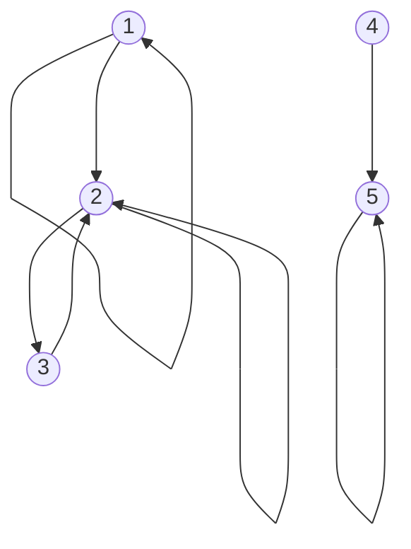
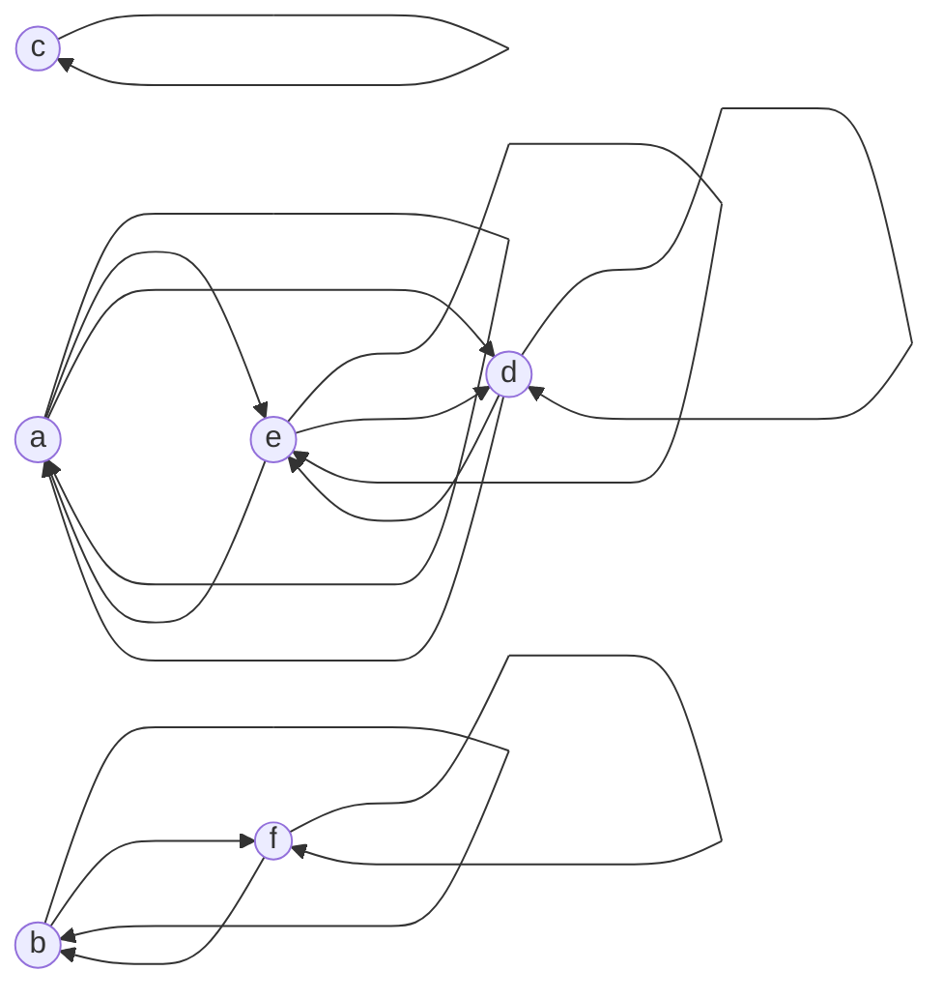
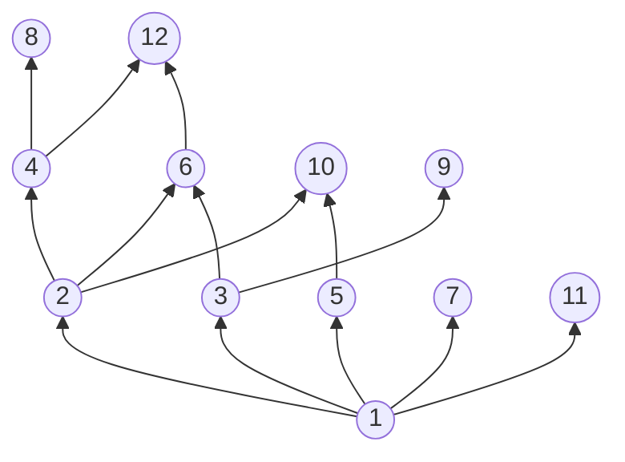

# Binary Relation as Directed Graph

Directed graph like the graph data structure in Computer Science can be used as a way to show binary relation between elements. If an element is related to another element we can draw a directed arrow from one element to another. s
- A graph can be infinite unlike the graph in Computer Science data structure which cannot be infinite due to limited amount of resource. 

Example: 
- Let $A = \{1, 2, 3, 4, 5\}$
- Let $R$ be a binary relation defined on $A$ as follow : $\{(1, 1), (2,2), (2, 3), (3, 2), (1, 2), (4, 5), (5, 5)\}$

A graph of the relation above would look like: 

Features of the graph above
- The graph is disconnected since there is two separate area of the graph that never relates to each other.
- An element pointing to itself is reflexive of itself such as 1, 2, 5 above. 
- Two elements pointing to each other is symmetric such as 2 and 3. 
- A element pointing to another element that is not pointing back is antisymmetric such as 4 pointing to 5 but 5 does not point back. 
- A transitive would be 1 point to 2 and 2 point to 3 therefore 1 also relates to 3. 

>Although directed graph is a concept in Computer Science it is really a mathematical concept. 

# Equivalence Relation 

A binary relation is an equivalence relation if and only if it is:
1. Reflexive
2. Symmetric 
3. Transitive

Equivalence relation forms a partition of the elements. All the elements that are related to each other is part of a "block" of the partition.
- These "blocks" are called equivalence classes 
	- Denoted as $[ ]$ 
	- So, $[a]$ is a equivalence class that contains a. 
	- $[a] = \{x \in A : x \mathrel R a\}$, this is a equivalence class that contains all the elements related to $a$ which is also a set that contains all elements of set $A$ that is equivalent to $a$. 

> All sets are classes but not all classes are sets. 
> - An equivalence class is a subset of a set that contains all elements equivalent to each other under a specific equivalence relation. In higher level math we can loosen the definition of an equivalence class to be an actual "class". But why is it not called a equivalence "set"? Well, probably because there was no distinct difference between sets and classes until modern set theory came into existence. 

Example: 
- Let $R$ be a binary relation defined over $\Bbb Z$ (which also means $R \subseteq \Bbb Z \times \Bbb Z$) such that $a \mathrel R b$ if and only if $a \equiv_3 b$. This is an equivalence relation.
	- We can defined 3 equivalence classes for the relation above: 
		- $[0] = \{a \in \Bbb Z : a \mathrel R 0\}$ this contains all integer elements that is congruent to 0 mod 3.
		- $[1] = \{a \in \Bbb Z : a \mathrel R 1\}$ this contains all integer elements that is congruent to 1 mod 3. 
		- $[2] = \{a \in \Bbb Z : a \mathrel R 2\}$ this contains all integer elements that is congruent to 2 mod 3.
	- As you can see the $\{[0], [1], [2]\}$ is a partition of $\Bbb Z$ and each "block" or class $[0], [1], [2]$ are all elements of the partition. Integer elements congruent to each other are all part of a "block" of the partition.

## Equivalence Relation Example From lecture: 

1. Let $A = \{a,b,c,d,e,f\}$ 
	1. Let $R$ be the binary relation defined over $A$ as $\{(a,a),(b,b),(c,c),(d,d),(e,e),(f,f),(a,e),(a,d),(d,a),(d,e),(e,a),(e,d),(b,f),(f,b)\}$
		1. You can check each order pair one by one to see if the relation is a equivalent relation but it is easier to draw a graph to visualize instead.

> The relation checks all boxes as reflexive, symmetric and transitive. Note that an element is symmetric to itself since it fits the definition of symmetric and an element is also transitive to itself since it also fits the definition of transitive.

# Partial Order Relation

A binary relation is a partial order if and only if it is: 
1. Reflexive
2. Antisymmetric
3. Transitive

> Common examples are:
> 1. $\leq$ over $\Bbb Z$ which is also a total order (get into that later)
> 2. Divisibility over $\Bbb N^{+}$ where $\{(a, b) \in \Bbb N^{+} \times \Bbb N^{+} : a | b\}$

## Partial Order in Directed Graph

A partial order corresponds to "reachability" basically (suppose) $a \mathrel R b$, is $b$ reachable from $a$ 
- Is there a path from $a$ to $b$?

A directed graph of partial order is represent by Directed Acyclic Graphs (DAGs)
- It is a graph where it does not have a cycle hence the term "Acyclic".
- However, a vertex of the graph is reachable from itself.
- Think of it like a stream that goes in one direction typically from bottom up. 
- A vertex can have more than one edge. 

> Yes, mathematicians really do say the term "DAGs".

## Example of Partial Order

1. Divisibility relation over $\Bbb N^{+}$ such that the relation is defined as $\{(a, b) \in \Bbb N^{+} \times \Bbb N^{+} : a | b\}$
	1. I am not going to draw out all the vertices since this graph is infinite
2. Starts at 1 since the domain is all positive natural number and 0 is not positive. Think what is the next layer? What numbers are only divisible by 1?
	1. Primes

> As you can see it is like a stream that continue to expand upwards:
> - The most minimum value is 1, there is no most maximum value since $\Bbb N^{+}$ grows infinitely large positively. Some graphs may not have a most minimum value similarly some graphs may have a most maximum value.
> - 6 is divisible by both 2 and 3 so we have 2 and 3 pointing to 6. 
> - 8 is divisible by 2 but we do not have a edge from 2 directly pointing to 8 since 4 already points to 8 and 8 can be reach from 2 through 4 since 4 is divisible by 2. This represent transitivity. 
> 	- Similarly, 12 can be reach from 2 through 4 or 6. 12 can also be reach from 3 through 6. 
> 	- An edge from 4 to 12 is needed since 12 is divisible by 4.

